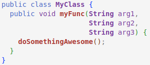
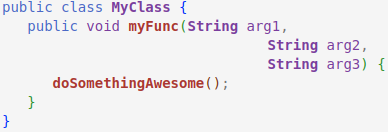
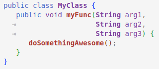

### Alignment Detection
Detects spaces used for indentation vs alignment based on number of leading spaces, and only stretches the spaces used for alignment.

*Note: This feature is disabled by default.  See `stretchySpaces.alignmentDetection` settings for how to enable and configure alignment detection.*

|  | |
| --- | --- |
| Example code without Stretchy Spaces   |  |
| Same code with Stretchy Spaces  (default configuration) |  |
| Same code with Stretchy Spaces   and alignment detection enabled |  |
